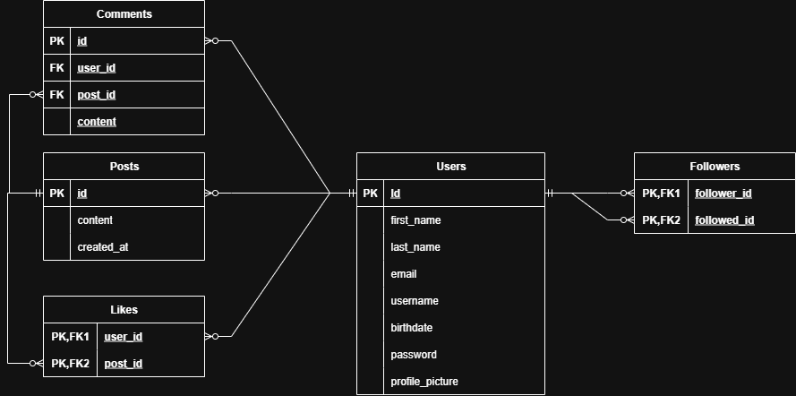

# Software Engineering Project 1
## Group 1
## Team Members
* Samuel Sarimo
* Niko Mehiläinen
* Auri Laitinen
## Description
This project is a small social media desktop application that works as a private chatroom/posting platform for you and your friends.
## Documentation
* [Vision](https://github.com/samuelms123/OTP-1/blob/main/documents/vision.md)
* [UI design](https://github.com/samuelms123/OTP-1/tree/main/documents/FigmaUI)
## Tech-stack
### Front-end:
* Java
* JavaFX
* Scene Builder
### Backend:
* MariaDb
* ORM/Jakarta Persistence API
* Java
* JWT and Bcrypt for authentication
* Docker
### Testing:
* Jenkins
* JUnit (integration- and unit testing)

Java FX is used for the front-end. The backend is powered by MariaDB for data storage, with ORM/Jakarta Persistence API for database interactions. JAAS Authentication is implemented for secure user authentication. Java was chosen for front- and backend to have a more unified tech stack which will make testing more streamlined. 

### Database:

