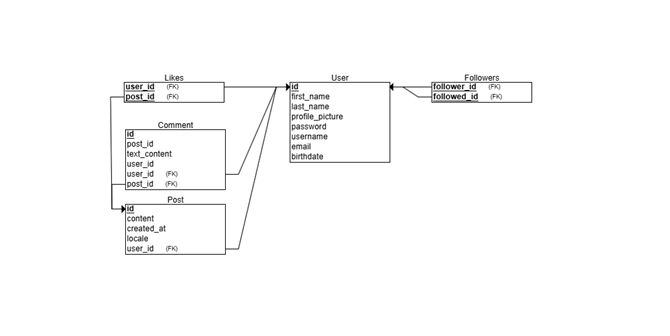
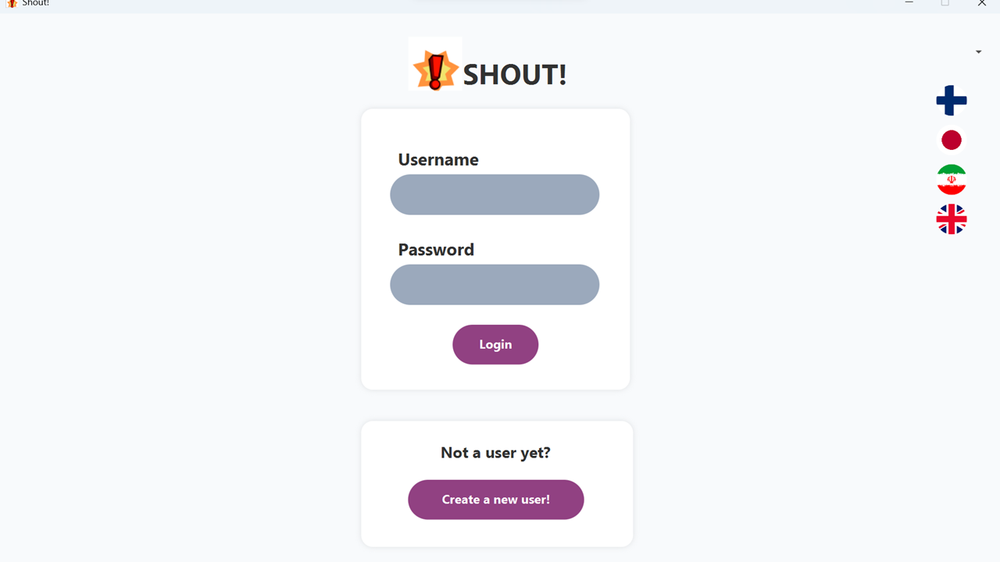
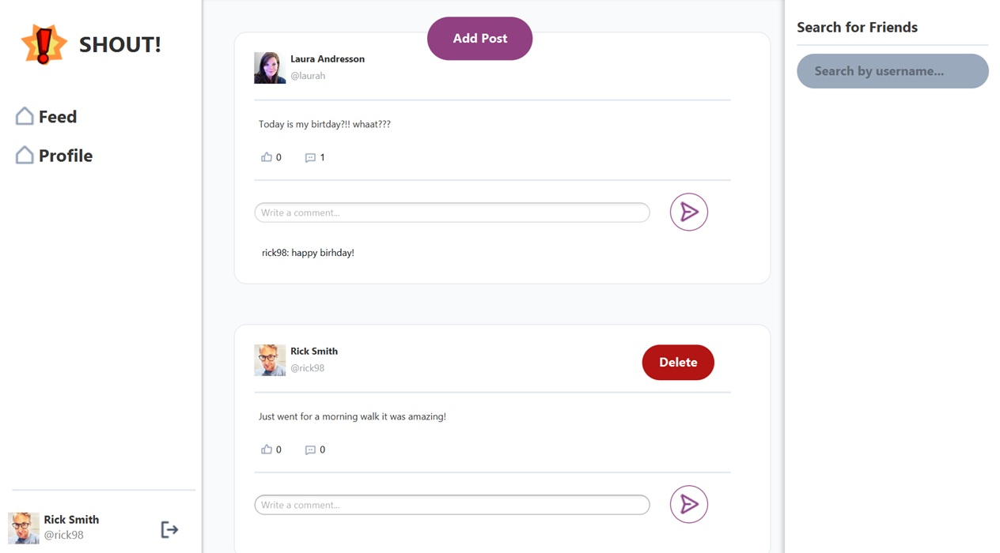

# Software Engineering Project 1 & 2
## Group 1
## Team Members
* [Auri Laitinen](https://github.com/aruraruri)
* [Niko Mehiläinen](https://github.com/mehiis)
* [Samuel Sarimo](https://github.com/samuelms123)
## Description
This project is a small social media desktop application that works as a private chatroom/posting platform for you and your friends.
## Documentation
* [Vision](https://github.com/samuelms123/OTP-1/blob/main/documents/vision.md)
* [UI design](https://github.com/samuelms123/OTP-1/tree/main/documents/FigmaUI)
## Tech-stack
### Front-end:
* Java
* JavaFX
* Scene Builder
### Backend:
* MariaDb
* ORM/Jakarta Persistence API
* Java
* JWT and Bcrypt for authentication
* Docker
### Testing:
* Jenkins
* JUnit (integration- and unit testing)
* SonarQube

Java FX is used for the front-end. The backend is powered by MariaDB for data storage, with ORM/Jakarta Persistence API for database interactions. JAAS Authentication is implemented for secure user authentication. Java was chosen for front- and backend to have a more unified tech stack which will make testing more streamlined.

### Localization:

Localization was done for Persian, English, Finnish and Japanese. Changing between languages is possible in login view (right top corner).

### Database:
**ERD**
  
**RDB**

## Screenshots:
  

[View more screenshots...](/docs/screenshots)